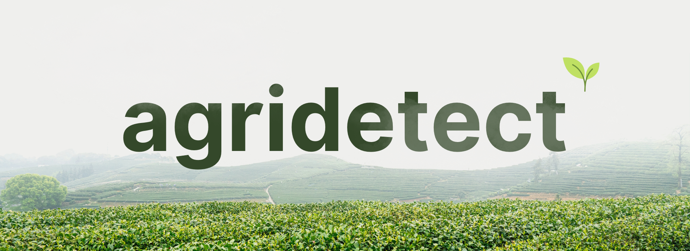

<p align="center">
  
</p>

# AgriDetect

Plant identification → segmentation → disease classification (with safe Grad-CAM explainability for disease-only predictions). Flask web app + TensorFlow models. This repo excludes datasets by [...] 

This README provides an expanded, practical guide for developers and researchers who want to run, extend, or retrain the AgriDetect pipeline.

## Summary

AgriDetect is an end-to-end pipeline for plant-level analysis in field/photos: identify the plant species, segment individual plants from an image, and classify diseases for each plant instance. The w[...]

Key design goals:
- Modular separation of concerns: `src/` contains application code, `models/` stores model weights and metadata, `uploads/` and `outputs/` are runtime directories.
- Safety-first interpretability: Grad-CAM visualizations are shown only when the disease prediction confidence passes a safety threshold, reducing misleading explanations for near-random outputs.
- Lightweight web UI/API for quick evaluation and human-in-the-loop feedback.

## Features
- Plant ID model (prototype-regularized, MixUp augmentation used during training)
- Instance segmentation with per-plant sanity checks (size, overlap, aspect ratio)
- Disease classifier per plant, with Grad-CAM explainability gated by confidence
- Feedback capture via SQLite (optional) for collected labels/annotations
- Dockerfile and quickstart scripts for reproducible local deployments (if provided)

## Tech stack
- Python 3.10+
- Flask, Werkzeug
- TensorFlow / Keras (2.x), NumPy, OpenCV, scikit-learn, Matplotlib
- SQLite for optional feedback capture

## Repository layout

```text
README.md
src/                # Flask app and inference pipeline
  app.py
  api.py
  inference/        # model wrappers, preprocessing, postprocessing
  utils/
models/             # model checkpoints and metadata
uploads/            # runtime: user uploads
outputs/            # runtime: model outputs, grad-cam visuals
data/               # (optional) small helper datasets or example inputs
scripts/            # training, evaluation, export helpers
requirements.txt
Dockerfile
```

Paths are configurable; see `src/config.py` for the app configuration.

## Quick start (development)

1. Clone the repo and create a Python venv

```bash
git clone https://github.com/pgtomvn/AgriDetect.git
cd AgriDetect
python -m venv .venv
source .venv/bin/activate  # or .venv\Scripts\activate on Windows
pip install -r requirements.txt
```

2. Provide model weights

- By default the repo does not include large model weights. Place trained checkpoints under `models/`:
  - `models/plant_id/` – plant identification model (.h5 or SavedModel)
  - `models/segmentation/` – instance segmentation model (SavedModel or mask checkpoint)
  - `models/disease/` – disease classifier checkpoints (one per species/domain)

You can also provide small demo weights in `models/demo/` for testing if available.

3. Run the Flask app locally

```bash
export FLASK_APP=src.app
export FLASK_ENV=development
flask run --host=0.0.0.0 --port=5000
```

On Windows (PowerShell):

```powershell
$env:FLASK_APP = "src.app"
$env:FLASK_ENV = "development"
flask run --host=0.0.0.0 --port=5000
```

Open http://localhost:5000 and use the web UI to upload images, or call the API directly (next section).

## API / Endpoints

The app exposes simple endpoints; check `src/api.py` for exact routes and validators.

- POST /api/v1/infer
  - form-data: file (image)
  - returns: JSON with per-plant detections, class labels, confidence scores and (if enabled) Grad-CAM image URLs or inline base64 images

- POST /api/v1/feedback
  - body: JSON with feedback entries (image id, predicted label, corrected label, notes)
  - stores feedback to SQLite if enabled

- GET /outputs/<filename>
  - serves generated artifacts (visualizations, crop images)

Example inference curl:

```bash
curl -X POST "http://localhost:5000/api/v1/infer" -F "file=@./examples/sample.jpg"
```

## Models & training notes

- Plant ID: trained with prototype-regularization and MixUp augmentation. Prototype regularization encourages tight, representative prototypes per class in embedding space; MixUp improves robustness t[...]
- Segmentation: model outputs instance masks and bounding boxes. Postprocessing enforces expected plant sizes and filters spurious small detections.
- Disease classifier: per-instance crops are normalized and passed to species-specific disease classifiers where applicable. Outputs include softmax probabilities and an optional Grad-CAM heatmap. Gra[...]

Training scripts live in `scripts/`; common example:

```bash
python scripts/train_disease.py --config configs/disease/resnet50.yaml --epochs 50
```

See the `scripts/` README or docstrings for hyperparameters and expected dataset layout.

## Datasets

This repository does not include full datasets. Suggested public datasets you can use for training/evaluation:
- PlantVillage (disease classification) — many species, lab images
- Field-level segmentation datasets (search for plant segmentation / weed crop datasets)

Data preprocessing should produce for segmentation: images + instance masks/annotations (COCO format recommended) and for classification: per-instance images + labels. See `src/inference/preprocessing[...]

## Configuration

Configuration variables are in `src/config.py` and can be overridden with environment variables. Important settings:
- MODEL_PATHS (plant_id, segmentation, disease)
- GRAD_CAM_THRESHOLD (float): min probability to enable Grad-CAM visualization
- UPLOAD_FOLDER / OUTPUT_FOLDER
- DATABASE_URL (for feedback SQLite path)

## Output artifacts

On inference, the app writes:
- per-image JSON summary with detections
- per-plant cropped images (optional)
- Grad-CAM visualizations (if enabled and safe)
Files are written under `outputs/` and can be served via the GET endpoints.

## Debugging & troubleshooting

- If model loading fails: check TensorFlow/Keras version compatibility and that the checkpoint format matches code expectations (SavedModel vs .h5).
- If Grad-CAM generation is slow: ensure GPU is available or reduce input sizes for the disease classifier.
- For segmentation false positives: tune size/aspect-ratio sanity-checks in `src/inference/postprocess.py`.

## Testing

- Unit tests: (if present) run via pytest

```bash
pytest -q
```

- Manual test: run the server and call the sample endpoint with diverse images.

## Contributing

Contributions are welcome.
- Bug fixes and small improvements: open a PR with a clear description and reproducer.
- New models/datasets: add under `models/` or `data/` and update `models/README.md` describing format and provenance.
- When adding large model weights, prefer publishing them externally (OSF / Zenodo / Google Drive) and include small download scripts under `scripts/` rather than committing large binaries to the repo[...]

Before opening a PR, run linters and tests.

## Acknowledgements & references

- PlantVillage dataset
- Grad-CAM: Selvaraju et al., 2017
- MixUp: Zhang et al., 2017
